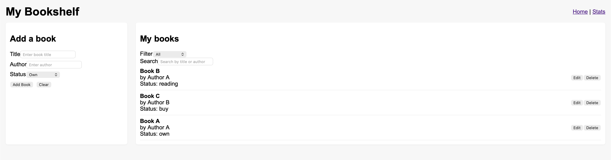

# Aplikasi Manajemen Buku Pribadi

Aplikasi kecil berbasis **React** untuk melacak buku yang kamu **miliki**, **sedang dibaca**, atau **ingin dibeli**. Menggunakan *functional components*, *Hooks*, *Context API*, *React Router*, *custom hooks*, dan *localStorage* untuk penyimpanan data secara persisten.

## Fitur
- Tambah, ubah, dan hapus data buku  
- Filter berdasarkan status (dimiliki / sedang dibaca / ingin dibeli)  
- Pencarian berdasarkan judul atau penulis  
- Halaman statistik dengan jumlah buku  
- Data tersimpan secara otomatis di `localStorage`

## Teknologi
- **React** (*functional components*, *Hooks*)  
- **Context API** untuk pengelolaan state global  
- **React Router** untuk navigasi multi-halaman  
- *Custom hooks*: `useLocalStorage`, `useBookStats`  
- Pengujian menggunakan **React Testing Library**

## Instalasi
1. `git clone <repo>`  
2. `npm install`  
3. Jalankan server pengembangan dengan `npm start`  
4. Jalankan pengujian unit dengan `npm test`

## Antarmuka
  

## Fitur React yang Digunakan
- `useState` dan `useEffect` untuk state lokal dan efek samping komponen  
- `useContext` + `createContext` untuk data buku global  
- `useMemo` dan `useCallback` di dalam hooks untuk meningkatkan performa  
- *Custom hooks* digunakan untuk sinkronisasi `localStorage` dan perhitungan statistik  
- **React Router** digunakan untuk navigasi antara halaman *Home* dan *Stats*

## Laporan Pengujian
Terdapat 5 *unit test* di dalam folder `src/tests/` yang mencakup:  
- Validasi formulir  
- Penambahan dan penampilan daftar buku  
- Pemeriksaan filter dan keberadaan elemen  
- Perilaku *custom hook* (`useLocalStorage`)  
- Keberadaan *Context Provider*  

## Catatan dan Rencana Pengembangan
- Tambahkan lebih banyak pengujian untuk fitur edit/hapus dan alur UX  
- Migrasikan gaya tampilan ke **Tailwind CSS** atau framework CSS lainnya  
- Tambahkan fitur pengurutan, paginasi, serta impor/ekspor data
