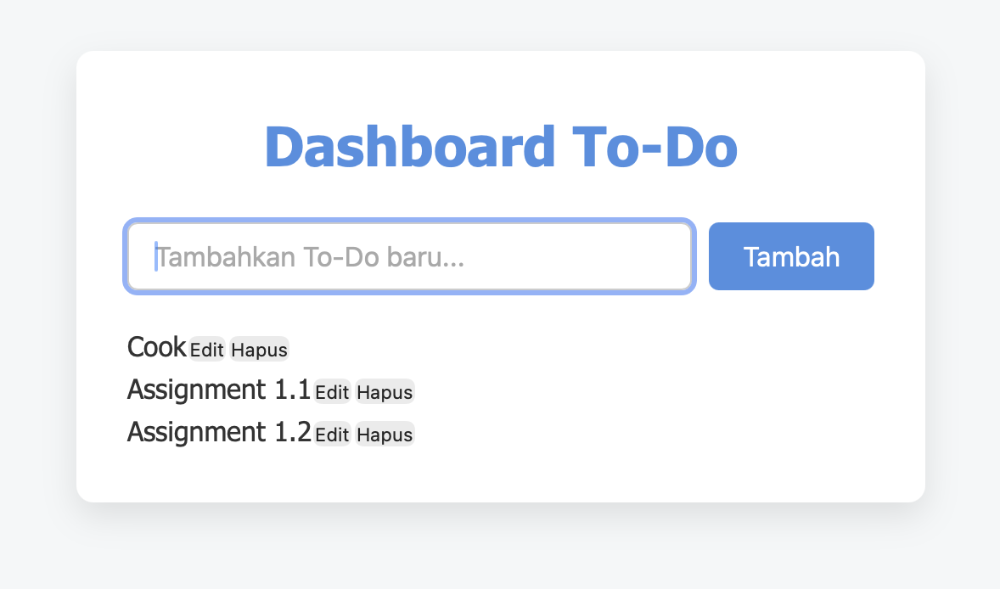

# Aplikasi Personal Dashboard - To-Do List

## Deskripsi Aplikasi
Aplikasi ini merupakan **personal dashboard sederhana** berbasis web yang memungkinkan pengguna untuk **menambahkan, mengedit, menghapus, dan menandai tugas (To-Do)**. Semua data tugas disimpan menggunakan **localStorage**, sehingga tetap tersimpan walaupun halaman direload.

Fitur utama dari aplikasi ini:
- Tambah tugas baru
- Edit tugas yang sudah ada
- Hapus tugas
- Tandai tugas sebagai selesai/selesai sebagian
- Persistensi data menggunakan localStorage
- UI interaktif yang sederhana dan mudah digunakan

## Screenshot
*(Ganti dengan screenshot aplikasi Anda setelah dijalankan)*

## Fitur ES6+ yang Digunakan
Aplikasi ini menggunakan beberapa fitur modern JavaScript (ES6+):
1. **`let` dan `const`** untuk deklarasi variabel
2. **Arrow function**:
   - Untuk event listeners
   - Untuk callback dalam `map` dan `forEach`
3. **Template literals** untuk render HTML secara dinamis
4. **Class `Todo`** untuk representasi setiap tugas
5. **Spread operator `...`** (jika digunakan saat manipulasi array)
6. **Async/Await** (dapat ditambahkan untuk simulasi async saat menyimpan atau memuat data)
7. **Array methods modern** (`map`, `forEach`, `filter`) untuk manipulasi data tugas

## Cara Menjalankan
1. Clone repository ini atau unduh file zip.
2. Buka file `index.html` di browser favorit Anda.
3. Gunakan form untuk menambahkan tugas baru.
4. Edit, hapus, atau tandai tugas langsung di daftar yang muncul.

## Struktur File
/index.html -> Halaman utama aplikasi
/js/app.js -> Semua logika aplikasi (To-Do class, event listener, render, localStorage)
/css/style.css -> Styling sederhana untuk aplikasi
README.md -> Dokumentasi ini

## Catatan
- Data tugas disimpan secara lokal pada browser menggunakan localStorage.
- Pastikan browser mendukung **ES6+**.
- Untuk screenshot yang akurat, jalankan aplikasi dan ambil tangkapan layar halaman utama.
